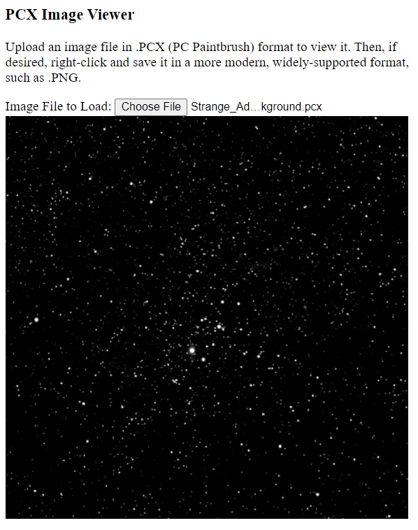

ImageViewerPcx
==============

An viewer for images in the PC Paintbrush .PCX format, implemented in JavaScript.

As of this writing, this is a work in progress.  It sort of works for decoding the images in the samples directory, but there are some defects and artifacts.

